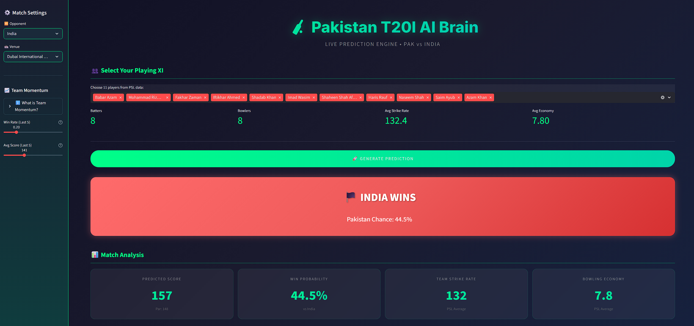
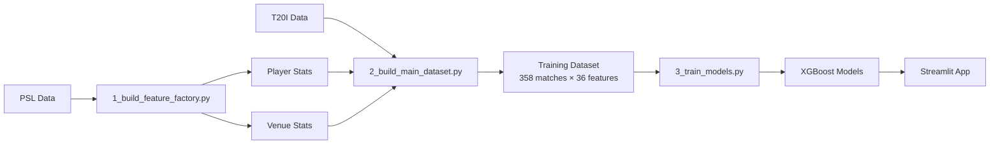

# 🏏 Pakistan T20I AI Predictor

[](https://www.python.org/)
[](https://xgboost.readthedocs.io/)
[](https://streamlit.io/)
[](LICENSE)

AI-powered prediction system for Pakistan T20I cricket matches using machine learning. Combines Pakistan Super League (PSL) player statistics with international T20I data to predict match scores and win probabilities.



## ✨ Features

- 🎯 **Dual Prediction Models**: Score prediction (XGBoost Regressor) & Win probability (XGBoost Classifier)
- 📊 **Hybrid Feature Engineering**: Leverages PSL player stats merged with T20I match data
- 🔥 **Rolling Form Analysis**: Captures team momentum using last 5 matches
- 🎨 **Interactive Dashboard**: Modern Streamlit UI with dark theme and glassmorphism
- 🔍 **SHAP Explainability**: Local and global model interpretation
- ⚙️ **What-If Scenarios**: Adjust team momentum and squad composition

## 🚀 Quick Start

### Prerequisites

```bash
Python 3.12+
pip
```

### Installation

```bash
# Clone repository
git clone https://github.com/yourusername/pakistan-t20i-ai-predictor.git
cd pakistan-t20i-ai-predictor

# Install dependencies
pip install -r requirements.txt
```

### Run the App

```bash
cd code
streamlit run app.py
```

Open browser at `http://localhost:8501`

## 📊 Model Performance

| Model | Metric | Value |
|-------|--------|-------|
| **Score Predictor** | R² Score | 0.253 |
| **Score Predictor** | MAE | ±18.48 runs |
| **Win Predictor** | Cross-Val Accuracy | 66.45% |
| **Win Predictor** | Test Accuracy | 59.72% |

*Note: T20 cricket is inherently unpredictable. These metrics are competitive with expert predictions (~60-65% accuracy).*

## 🛠️ Tech Stack

**Machine Learning**
- XGBoost (Gradient Boosting)
- scikit-learn (Model Selection & Evaluation)
- SHAP (Model Interpretation)

**Data Processing**
- pandas (Data Manipulation)
- NumPy (Numerical Computing)

**Visualization & Deployment**
- Streamlit (Web Application)
- Matplotlib (Charts & Plots)

## 📁 Project Structure

```
pakistan-t20i-ai-predictor/
├── code/
│   ├── 1_build_feature_factory.py    # Extract PSL player statistics
│   ├── 2_build_main_dataset.py       # Build training dataset with features
│   ├── 3_train_models.py             # Train XGBoost models with GridSearchCV
│   └── app.py                        # Streamlit web application
├── data/
│   ├── PSL.csv                       # Pakistan Super League ball-by-ball data
│   ├── T20I.csv                      # International T20I ball-by-ball data
│   ├── player_stats.csv              # Generated: PSL player statistics
│   ├── venue_stats.csv               # Generated: Venue average scores
│   └── final_advanced_data.csv       # Generated: Training dataset (358 matches)
├── models/
│   ├── score_model_final.pkl         # Trained score prediction model
│   ├── win_model_final.pkl           # Trained win prediction model
│   └── feature_names.pkl             # Feature list
├── requirements.txt
└── README.md
```

## 🔄 Data Pipeline



## 🎯 How It Works

### 1. Feature Extraction
`1_build_feature_factory.py` processes PSL data to extract:
- Player batting averages & strike rates
- Bowling economies & averages
- Venue par scores (1st innings averages)

**Filters**: Minimum 50 balls faced/bowled for statistical significance

### 2. Dataset Building
`2_build_main_dataset.py` creates match-level features:

**Hybrid Features**:
- Team composition: Average PSL stats of playing XI
- Venue intelligence: Par scores from PSL data with T20I fallback
- Rolling form: Last 5 matches batting average & win rate
- Differential features: Deviation from global baselines

**36 Features Generated**:
- 10 core features (venue, team, form)
- 26 opponent one-hot encoded features

### 3. Model Training
`3_train_models.py` uses GridSearchCV to find optimal hyperparameters:

**Hyperparameter Space**: 720 combinations tested
- Learning rates: 0.001 to 0.1
- Tree depth: 3 to 8
- Estimators: 100 to 1000
- Regularization: subsample & colsample variations

**Training Time**: ~10-20 minutes on standard CPU

### 4. Deployment
`app.py` provides interactive predictions:
- Select opponent, venue, playing XI
- Adjust team momentum sliders
- Generate instant predictions with explanations

## 📈 Key Features Explained

### Rolling Form Stats (The "Secret Sauce")
```python
# Computed BEFORE each match using only PREVIOUS games
pak_recent_form_batting = df['score'].shift(1).rolling(window=5).mean()
pak_recent_form_win_rate = df['won'].shift(1).rolling(window=5).mean()
```
- `.shift(1)` prevents data leakage
- Captures hot streaks and momentum
- Proven predictor in cricket analytics

### Fallback Mechanism
When PSL data is unavailable for a player:
- Batting Average: 20.0
- Strike Rate: 120.0
- Economy: 8.5

Approximately 60% of matches have full PSL coverage for Pakistan's XI.

## 🎨 Streamlit Dashboard Features

- **Dark Theme**: Modern gradient backgrounds with glassmorphism
- **Interactive Controls**: Opponent, venue, and momentum sliders
- **Squad Builder**: Select 11 players from 48 Pakistan internationals
- **SHAP Analysis**: 
  - Global: Top 15 feature importance
  - Local: Per-prediction waterfall plots
- **Visual Analytics**: Squad depth charts, strike rates, economy rates

## 🔮 Future Enhancements

- [ ] Add opponent strength metrics (ICC rankings)
- [ ] Incorporate toss data from match-level sources
- [ ] Weather and pitch condition features
- [ ] Live ball-by-ball prediction updates
- [ ] Ensemble methods (XGBoost + LightGBM + CatBoost)
- [ ] Mobile-responsive design
- [ ] Historical prediction tracking

## 📊 Dataset Information

**PSL Data**: 2016-2025 Pakistan Super League (~17MB)
- 287 players with qualifying statistics
- 7 venues with historical averages

**T20I Data**: International matches up to 2024 World Cup (~109MB)
- 358 Pakistan matches with complete data
- 23 unique opponents

## 🤝 Contributing

Contributions welcome! Please feel free to submit a Pull Request.

1. Fork the repository
2. Create your feature branch (`git checkout -b feature/AmazingFeature`)
3. Commit your changes (`git commit -m 'Add some AmazingFeature'`)
4. Push to the branch (`git push origin feature/AmazingFeature`)
5. Open a Pull Request

## 📝 Citation

If you use this project in your research, please cite:

```bibtex
@software{pakistan_t20i_predictor,
  author = {Muhammad Ali Bukhari},
  title = {Pakistan T20I AI Predictor},
  year = {2024},
  url = {https://github.com/yourusername/pakistan-t20i-ai-predictor}
}
```

## 📄 License

This project is licensed under the MIT License - see the [LICENSE](LICENSE) file for details.

## 🙏 Acknowledgments

- Pakistan Super League for providing detailed cricket data
- XGBoost team for the powerful gradient boosting library
- Streamlit team for the amazing web framework
- SHAP library for model interpretability

## 📧 Contact

Muhammad Ali Bukhari - [@yourhandle](https://twitter.com/yourhandle)

Project Link: [https://github.com/yourusername/pakistan-t20i-ai-predictor](https://github.com/yourusername/pakistan-t20i-ai-predictor)

---

**⭐ Star this repository if you found it helpful!**


